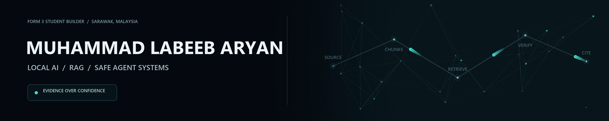

  

**I build systems that have to show their evidence.**

I am a Form 3 secondary-school student in Sarawak, Malaysia. My work focuses on local AI, retrieval-augmented generation, safe agent access, cybersecurity, and verifiable computing systems.

## Selected work

| Project | What I built | Evidence |
| --- | --- | --- |
| **[CyberRAG](https://github.com/Labeeb2339/cyber-rag)** | Local threat-intelligence RAG with hybrid retrieval, reciprocal-rank fusion, ATT&CK grounding, Ollama inference, and citations. | On a fixed 15-question pilot, keyword coverage increased from `0.627` to `0.843`; context hit rate reached `0.933`. |
| **[Local Evidence MCP](https://github.com/Labeeb2339/local-evidence-mcp)** | A constrained evidence server with allowlisted reads, path containment, redaction, deterministic fallback, and safe writes. | `18` regression tests cover containment, redaction, fallback retrieval, symlinks, cache hygiene, and JSON-RPC behaviour. |
| **[Edge AI RTL Lab](https://github.com/Labeeb2339/edge-ai-rtl-lab)** | A signed INT8 SystemVerilog dot-product core with a bit-exact Python model, generated vectors, backpressure, and saturation. | Python tests, simulator regression, and Yosys structural synthesis checks run in CI. |
| **[CustodianMesh AI](https://github.com/Labeeb2339/custodian-mesh-ai)** | Policy-gated federated-AI simulator using synthetic custodian nodes, runtime output and provenance validation, and inspectable decision traces. | `18` automated tests and a fixed `30`-case policy evaluation cover allowed, denied, and adversarial paths. |
| **[DataTrust Gate](https://github.com/Labeeb2339/data-trust-gate)** | Bounded browser-based dataset release auditor for privacy signals, leakage, duplicates, labels, provenance, and licensing. | A fixed `15`-case regression, `16` unit tests, and `6` integration tests check expected failures without flagging the `10` clean cases. |

> **Scope:** These are student-built prototypes and small evaluations—not deployed agency systems, production security products, or silicon results.

## Applied projects

- **[ScamShield AI](https://github.com/Labeeb2339/scamshield-ai-case-study)** — privacy-first Malaysian scam-risk prototype with on-device classification, explainable rules, OCR, QR, and link checks. The reviewed case study records `202` passing Flutter tests.
- **[555 Build Bench](https://github.com/Labeeb2339/555-build-bench)** — local workflow from NE555 calculations to LTspice preparation, staged assembly, and measurement logging.

## Engineering approach

`define the claim` → `build the smallest credible system` → `test it` → `publish the boundary`

- AI answers should cite the evidence used.
- Agents should expose their permissions and tool traces.
- Hardware outputs should agree with a reproducible software model.
- Simulated, implemented, and measured results should never be mixed together.

## Working with

Python · TypeScript · Dart/Flutter · FastAPI · RAG evaluation · Ollama · MCP · SystemVerilog · Yosys · GitHub Actions

I welcome technical feedback, mentorship, job shadowing, student programmes, and small supervised pilot projects.

[LinkedIn](https://www.linkedin.com/in/muhammad-labeeb-aryan-bin-mohd-lokman-369211300/) · [All repositories](https://github.com/Labeeb2339?tab=repositories)
