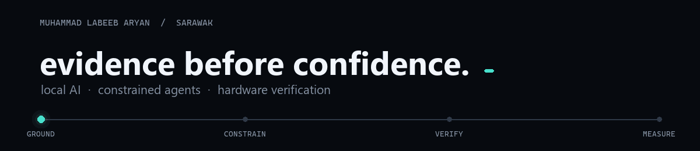

  

# Muhammad Labeeb Aryan

**I build systems that have to show their evidence.**

Form 3 secondary-school student in Sarawak, Malaysia, building across local AI, agent safety, cybersecurity, embedded systems, and digital hardware verification.

> An AI answer should cite its source. An agent should reveal its permissions. RTL should agree with a golden model. A circuit calculation stays a prediction until it is measured.

## The questions I build around

1. Can useful AI stay local, grounded, and measurable?
2. Can an agent use evidence without receiving broad filesystem authority?
3. Can quantized AI arithmetic be traced from a Python contract into reproducible RTL?

## Evidence trail

### 01 · [CyberRAG](https://github.com/Labeeb2339/cyber-rag)

**Question:** Can retrieval improve a small local model on threat-intelligence work while keeping the normal query path on the user's machine?

**Built:** Hybrid vector + BM25 retrieval, reciprocal-rank fusion, MITRE ATT&CK graph grounding, local Ollama inference, citations, and a fixed evaluation harness.

**Checked:** On a 15-question pilot, keyword coverage moved from `0.627` to `0.843`; context hit rate reached `0.933`. Tests and CI are included.

**Boundary:** This is a small pilot—not proof of production readiness or cloud-model parity.

---

### 02 · [Local Evidence MCP](https://github.com/Labeeb2339/local-evidence-mcp)

**Question:** How can an agent use a useful evidence set without receiving arbitrary filesystem access?

**Built:** Policy-gated reads, path and symlink containment, redaction, lexical fallback, safe create-only notes, and append-only lessons.

**Checked:** `18` regression tests cover containment, redaction, fallback retrieval, cache hygiene, safe-write semantics, symlinks, and JSON-RPC behaviour.

**Boundary:** It is a compact local reference implementation—not an enterprise authorization service or hosted vector database.

---

### 03 · [Edge AI RTL Lab](https://github.com/Labeeb2339/edge-ai-rtl-lab)

**Question:** Can signed INT8 inference arithmetic be made reproducible from software intent to synthesizable RTL?

**Built:** A parameterized SystemVerilog dot-product core with ready/valid control, output backpressure, signed saturation, a bit-exact Python model, deterministic vectors, and a self-checking testbench.

**Checked:** Python arithmetic tests, simulator regression, and Yosys structural checks run in CI across multiple vector lengths.

**Boundary:** No FPGA timing closure, ASIC implementation, power result, or silicon validation is claimed.

## Applied systems

- **[ScamShield AI](https://github.com/Labeeb2339/scamshield-ai-case-study)** — a privacy-first Malaysian scam-risk prototype using on-device classification, explainable rules, OCR, QR, and link checks. The reviewed case study records `202` passing Flutter tests and a clean analyzer run.
- **[555 Build Bench](https://github.com/Labeeb2339/555-build-bench)** — a local-first workflow from NE555 calculation to LTspice preparation, staged assembly, and measurement logging. Predictions remain explicitly separate from measured results.

## How I work

- Define the claim before building the demo.
- Attach tests, evaluation, or measurements to the claim.
- State what is simulated, implemented, and still unverified.
- Keep credentials, private data, and unsafe history out of public releases.

## Current direction

I want to apply this approach where trust matters:

- sovereign and local AI with evidence, permissions, and auditability;
- safe agent harnesses for constrained organisational data;
- Python-driven digital verification and hardware/software co-design;
- practical systems for Sarawak communities and technical teams.

I am open to technical feedback, mentorship, job shadowing, student programmes, and small supervised pilot projects.

[LinkedIn](https://www.linkedin.com/in/muhammad-labeeb-aryan-bin-mohd-lokman-369211300/) · [All repositories](https://github.com/Labeeb2339?tab=repositories)
