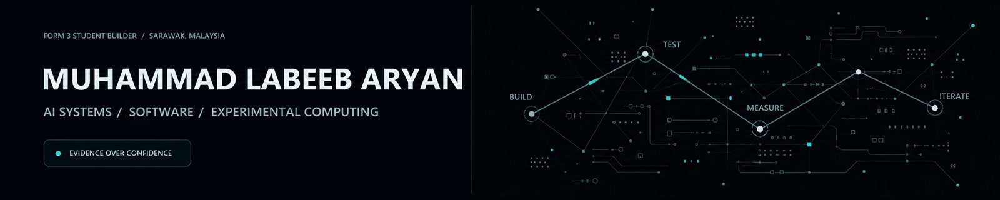

# Muhammad Labeeb Aryan

Form 3 student from Sarawak, Malaysia.

I build things I can explain and test: inspectable prototypes, not marketing
promises.  
My projects are split by confidence:

- I know what is implemented.
- I log what is measured.
- I keep limits explicit.

[LinkedIn](https://www.linkedin.com/in/muhammad-labeeb-aryan-bin-mohd-lokman-369211300/) |
[Repositories](https://github.com/Labeeb2339?tab=repositories)

 

## Flagship work

| Project | Focus | What it shows |
| --- | --- | --- |
| **[RecurQuant](https://github.com/Labeeb2339/recurquant)** | AI inference | Recurrent-state quantization with fixed contracts and measurable memory trade-offs. |
| **[CliffQuant](https://github.com/Labeeb2339/cliffquant)** | Quantization | W4A16/FP16 flow, explicit checkpoints, and reproducible scripts. |
| **[CyberRAG](https://github.com/Labeeb2339/cyber-rag)** | RAG | Local retrieval with graph grounding and deterministic evaluation. |
| **[Edge AI RTL Lab](https://github.com/Labeeb2339/edge-ai-rtl-lab)** | Digital hardware | INT8 signed compute blocks with regression checks between RTL and Python model. |
| **[StrataMoE Lab](https://github.com/Labeeb2339/stratamoe-lab)** | AI systems | Resource-placement simulator with provenance traces and reproducible runs. |
| **[Local Evidence MCP](https://github.com/Labeeb2339/local-evidence-mcp)** | Tooling | Constrained evidence workflow with allowlists, redaction, and tests. |
| **[SFTGuard](https://github.com/Labeeb2339/sftguard)** | Fine-tuning reliability | Dataset and training safety checks with traceable failure rules. |

## Built and documented

- **[ScamShield AI Case Study](https://github.com/Labeeb2339/scamshield-ai-case-study)** — privacy-first scam-risk prototype notes and flow.
- **[555 Build Bench](https://github.com/Labeeb2339/555-build-bench)** — my personal hardware bench workflow and logs.
- **[Shark Habitat Prototype](https://github.com/Labeeb2339/shark-habitat-prototype)** — earlier exploration kept for continuity.

## Work style

I use one rule: claim only what can be reproduced.

- Build small, test hard, publish what passed and what did not.
- Keep implementation, simulation, and measured output in separate sections.
- Keep negative findings with the same visibility as positive ones.

Core stack: Python, PyTorch, TypeScript, Dart/Flutter, FastAPI, MCP, SystemVerilog,
Yosys, GitHub Actions.

I'm open to structured mentorship, internships, and supervised technical
collaborations.
